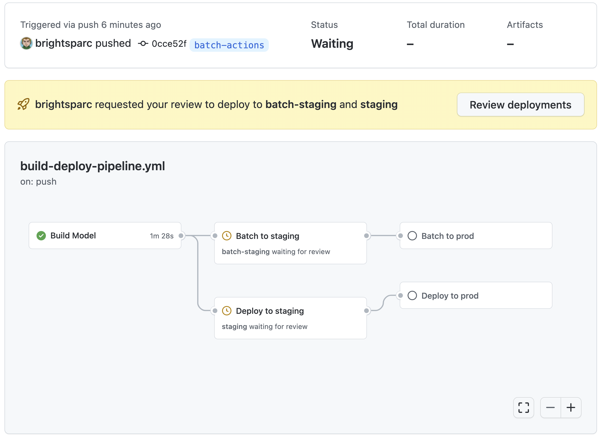
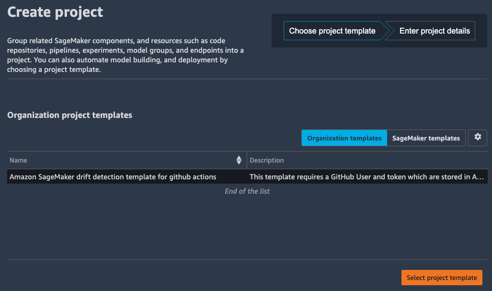
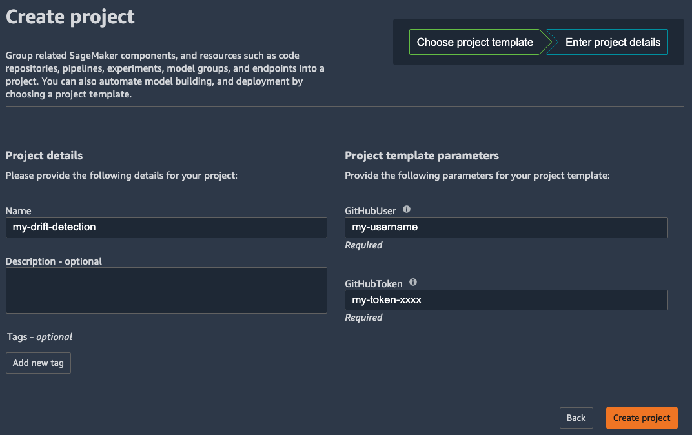

# AWS SageMaker Workflow for GitHub Actions

This template repository contains a sample application and sample GitHub Actions workflow files for continuously deploying both application code and infrastructure as code with GitHub Actions.

This MLOps workflow demonstrates training and evaluating a machine learning model to predict taxi fare from the public [New York City Taxi dataset](https://registry.opendata.aws/nyc-tlc-trip-records-pds/) deployed with Amazon SageMaker. 

## Get Started

Use this following AWS CloudFormation quick start to create a custom [SageMaker MLOps project](https://docs.aws.amazon.com/sagemaker/latest/dg/sagemaker-projects-templates-custom.html) template in the [AWS Service Catalog](https://aws.amazon.com/servicecatalog/) and configure the portfolio and products so you can launch the project from within your Studio domain.

[](https://console.aws.amazon.com/cloudformation/home?region=us-east-1#/stacks/quickcreate?templateUrl=https%3A%2F%2Faws-ml-blog.s3.amazonaws.com%2Fartifacts%2Famazon-sagemaker-drift-detection%2Fgithub-actions-service-catalog.yml&stackName=drift-pipeline&param_ExecutionRoleArn=&param_PortfolioName=SageMaker%20Organization%20Templates&param_PortfolioOwner=administrator&param_ProductVersion=1.0)

Follow are the list of the parameters. 

| Parameters         | Description                                    |
| ------------------ | ---------------------------------------------- |
| ExecutionRoleArn   | The SageMaker Studio execution role (required) |
| PortfolioName      | The name of the portfolio                      |
| PortfolioOwner     | The owner of the portfolio                     |
| ProductVersion     | The product version to deploy                  |

You can copy the the required `ExecutionRoleArn` role from your **User Details** in the SageMaker Studio dashboard.


### Get GitHub Access Key

The above cloud formation template will also create a new IAM User and [Access Key](https://docs.aws.amazon.com/powershell/latest/userguide/pstools-appendix-sign-up.html), which value is stored in AWS [Secrets Manager](https://docs.aws.amazon.com/secretsmanager/latest/userguide/intro.html).

Retrieve the IAM access key credentials require for setting up GitHub Actions using the following CLI command:

```
aws secretsmanager get-secret-value \
  --secret-id sagemaker-github-actions-user \
  --region us-east-1 \
  --query SecretString \
  --output text
```

## Creating a new GitHub Repository

Create a new repository from the [amazon-sagemaker-drift-detection](https://github.com/aws-samples/amazon-sagemaker-drift-detection/generate) template giving it a name eg `my-drift-detection`

### Setup the environment

Your new repository includes includes three [GitHub Actions](https://docs.github.com/en/actions/learn-github-actions/understanding-github-actions) workflows:
1. The `Build Model Pipeline` workflow will create or update a SageMaker Model Build Pipeline using AWS CloudFormation.
2. The `Batch Pipeline` workflow will create or update a SageMaker Pipeline to run Batch Scoring for Staging and Production environments.
3. The `Endpoint Deployment` workflow will deploy SageMaker Endpoints to Staging and Production environments.

These jobs are configured to run against a specific [environments](https://docs.github.com/en/actions/reference/environments) which require secrets to be setup for the above AWS Credentials and optional *protection rules*.



The new repository has a 

1. `development` environment in which runs your `Build Model` job and starts the SageMaker pipeline execution.  On completion this pipeline will publish a model to the Registry.  It is recommend you run this on `pull_request` and `push` events.
2. `staging` environment will enable you to run the `Batch Pipeline` and `Endpoint Deploy` jobs respectively in staging.
3. `prod` environment will enable you to run the `Batch Pipeline` and `Endpoint Deploy` jobs respectively in production.
  * You should configure a *protection rule* for your operations team which will approve this only once they are happy that the staging environment has been tested.

For each of the environments you will require setting up the following secrets.
1. Create a secret named `AWS_ACCESS_KEY_ID` containing the `AccessKeyId` value returned above.
2. Create a secret named `AWS_SECRET_ACCESS_KEY` containing in the `SecretAccessKey` value returned above.

When the workflow successfully completes, drift detection is configured to trigger re-training on drift detection in the production batch pipeline or real-time endpoint.

### Create a Personal Access Token

You will also need to create a [personal access token](https://docs.github.com/en/authentication/keeping-your-account-and-data-secure/creating-a-personal-access-token) that has `repo` scope to enable you to send a [workflow dispatch](https://docs.github.com/en/rest/reference/actions#create-a-workflow-dispatch-event) event.

Copy the token generated, as you will need it for step 9 below.

## Creating a new Project in Amazon SageMaker Studio

Once your MLOps project template is registered in **AWS Service Catalog** you can create a project using your new template.

1. Switch back to the Launcher
2. Click **New Project** from the **ML tasks and components** section.

On the Create project page, SageMaker templates is chosen by default. This option lists the built-in templates. However, you want to use the template you published for Amazon SageMaker drift detection.

3. Choose **Organization templates**.
4. Choose **Amazon SageMaker drift detection template for github actions**.
5. Choose **Select project template**.



6. In the **Project details** section, for **Name**, enter the name of the GitHub repository you created above eg `my-drift-detection`.
  - The project name must have 32 characters or fewer.
7. In the Project template parameter, for **RetrainSchedule**, input a validate [Cron Schedule](https://docs.aws.amazon.com/sagemaker/latest/dg/model-monitor-schedule-expression.html)
  - This defaults to `cron(0 12 1 * ? *)` which is the first day of every month.
8. For **GitHubUser** specify your username under which you created the GitHub repository
9. For **GitHubToken** specify the personal access token that you copied above.
10. Choose **Create project**.



## Testing

You can test the pipeline with a github repository that has the same name as your SageMaker Project.
Export the environment variables for the `SAGEMAKER_PROJECT_NAME` and `SAGEMAKER_PROJECT_ID` created by your SageMaker Project cloud formation.
Also pass the `GITHUB_USER` and `GITHUB_TOKEN` from the personal access token created above.

Then run the `python` command:

```
export SAGEMAKER_PROJECT_NAME=<<existing-project-name>>
export SAGEMAKER_PROJECT_ID=<<existing-project-id>>
export GITHUB_USER=<<your-github-username>>
export GITHUB_TOKEN=<<your-personal-token>>
cdk deploy github-actions -c drift:ProductsUseRoleName="" \
    --parameters SageMakerProjectName=$SAGEMAKER_PROJECT_NAME \
    --parameters SageMakerProjectId=$SAGEMAKER_PROJECT_ID \
    --parameters GitHubUser=$GITHUB_USER \
    --parameters GitHubToken=$GITHUB_TOKEN
```